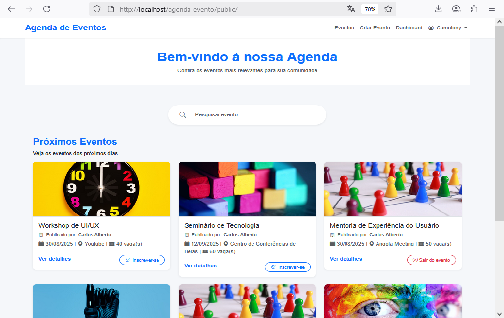

# Agenda de Eventos com Laravel 9 📅
Este é um sistema simples de **agenda de eventos** desenvolvido com
**Laravel 9**, utilizando **MySQL** como banco de dados, **Jetstream**
para autenticação e **Bootstrap** para estilização.

------------------------------------------------------------------------

## Demonstração



------------------------------------------------------------------------

## Tecnologias Utilizadas

-   [Laravel 9](https://laravel.com/docs/9.x)
-   [MySQL](https://www.mysql.com/)
-   [Jetstream](https://jetstream.laravel.com/2.x/introduction.html)
-   [Bootstrap](https://getbootstrap.com/)

------------------------------------------------------------------------

## Let's instail 🚀:

Siga os passos abaixo para rodar o projeto localmente.

### 1️⃣ Clonar o repositório

``` bash
git clone https://github.com/seu-usuario/seu-repositorio.git
cd laravel-events-agenda
```

### 2️⃣ Instalar dependências

``` bash
composer install
npm install
```

### 3️⃣ Configurar o ambiente

Copie o arquivo `.env.example` e configure:

``` bash
cp .env.example .env
```

Edite o `.env` e configure a conexão com o MySQL:

``` env
DB_DATABASE=events_agenda
DB_USERNAME=root
DB_PASSWORD=
```

### 4️⃣ Gerar chave da aplicação

``` bash
php artisan key:generate
```

### 6️⃣ Rodar o servidor local

``` bash
php artisan serve
```

Acesse no navegador: **http://127.0.0.1:8000**

------------------------------------------------------------------------

## Contribuição

Contribuições são bem-vindas!\
Faça um **fork**, crie uma branch, faça suas alterações e abra um **Pull
Request**.

------------------------------------------------------------------------

## Licença

Este projeto está sob a licença MIT. Consulte o arquivo
[LICENSE](LICENSE) para mais detalhes.

------------------------------------------------------------------------

Desenvolvido por **Graciano André Leite**
